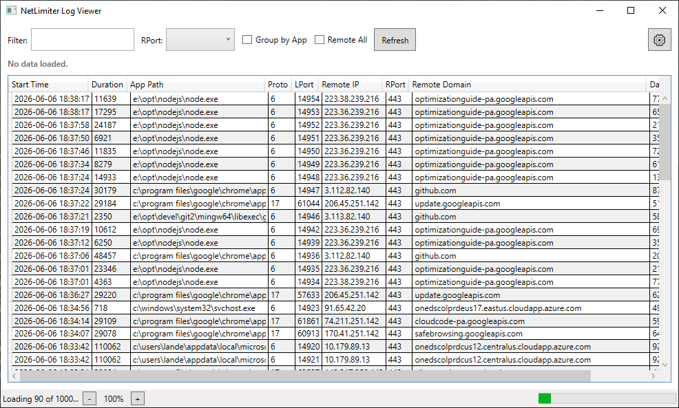

<table border="0">
  <tr>
    <td>
      06-Jun-2026<br>
      Windows<br>
      <a href="https://landenlabs.com/index.html">Home</a>
    </td>
    <td>
      <a href="https://landenlabs.com/index.html">
        
      </a>
    </td>
  </tr>
</table>

# ShowNetLog (NetLimiter Log Viewer)


A WPF application that provides a sortable and filterable interface for viewing network traffic logs captured by **NetLimiter 5**. It parses the local SQLite database to provide a rich overview of application network activity.

**By [LanDen Labs](https://github.com/landenlabs) - Dennis Lang (2026)**

---

## Screenshots

**Main Log Viewer**



---

## Features

- **Asynchronous Data Loading** — the UI opens immediately and streams data from the database.
- **Progress Tracking** — real-time progress bar and status updates during large database parses.
- **Group by App** — toggleable grouping to collapse rows by application path.
- **Multi-Select RPort Filter** — filter logs by specific remote ports via a checkable dropdown.
- **"Remote All" Toggle** — quickly hide or show entries with "Unknown" remote IPs.
- **Font Zoom Control** — adjust the table scale from 50% to 300% for better readability.
- **Time Range Summary** — see exactly what period the loaded data covers.
- **Dynamic Columns** — toggle the visibility of Local IP and Local Domain columns via Settings.
- **Settings Dialog** — view app metadata (version, build date) and manage preferences.

---

## Requirements

- **NetLimiter 5** — must be installed with data at the default path:  
  `C:\ProgramData\Locktime\NetLimiter\5\Stats\nlstats.db`
- **.NET 10.0 Desktop Runtime**

---

## Installation & Usage

### Building from Source

```cmd
git clone https://github.com/landenlabs/show-netlog.git
cd show-netlog
dotnet build
dotnet run
```

### Controls

| Action | Result |
|--------|--------|
| **Filter TextBox** | Real-time search in App Path, IPs, and Domains. |
| **RPort Dropdown** | Check/Uncheck ports to filter the list. |
| **Refresh** | Reload the latest 1000 records from the database. |
| **Zoom [- 100% +]** | Scale the table font size. |
| **Settings (⚙)** | Access app info and toggle "All Columns". |

---

## Project Structure

```
show-netlog/
├── MainWindow.xaml       # Main UI layout
├── MainWindow.xaml.cs    # Core logic (SQL parsing, Filtering, Zoom)
├── SettingsWindow.xaml   # Settings & About dialog
├── SettingsWindow.xaml.cs
├── App.xaml              # Application entry point
├── show-netlog.csproj    # Project configuration & dependencies
└── screens/
    ├── icon.png          # App icon
    └── netlog-view-1.png # Application screenshot
```

---

## Credits

- **SQLite Engine** — [Microsoft.Data.Sqlite](https://learn.microsoft.com/en-us/dotnet/standard/data/sqlite/)
- **Data Source** — [NetLimiter 5](https://www.netlimiter.com/)

---

## License

Copyright (c) 2026 LanDen Labs - Dennis Lang
